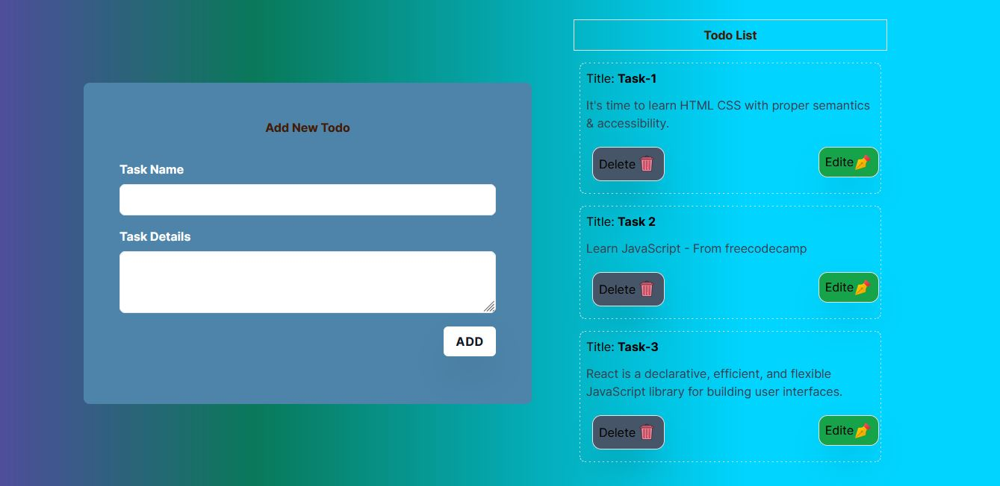
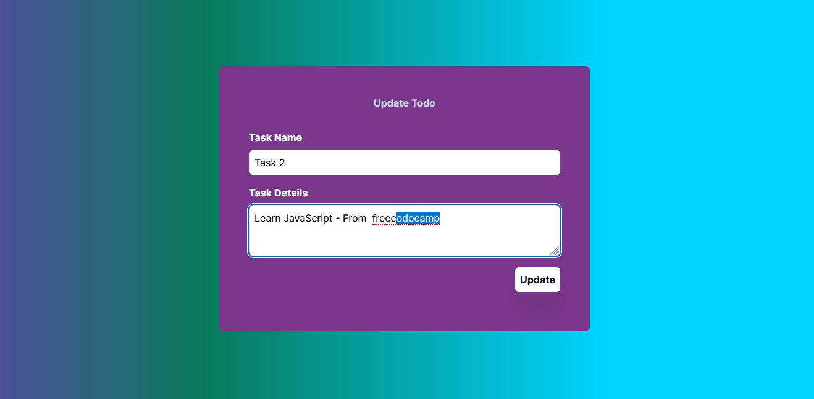

<h1 align="center" style="font-weight: bold;">Firebase CRUD 💻</h1>


<h2 id="layout">🎨 Layout</h2>

<p align="center">




</p>
 
                  

<h2 id="technologies">💻 Technologies</h2>

- REACT JS
- NEXT.js
- Firebase Cloud function
- firebase firestore
 
<h2 id="started">🚀 Getting started</h2>

Here you describe how to run your project locally
 
<h3>Prerequisites</h3>

Here you list all prerequisites necessary for running your project. For example:

- [NodeJS](https://github.com/)
- [Git 2](https://github.com)
 
<h3>Cloning</h3>

How to clone your project

```bash
git clone https://github.com/Barrack-Org/firebase-project.git
```
 
<h3>Starting</h3>

How to start your project

```bash
cd project-name
npm  run dev
cd  ..
npm run serve
```
"# Firebase-CRUD" 
